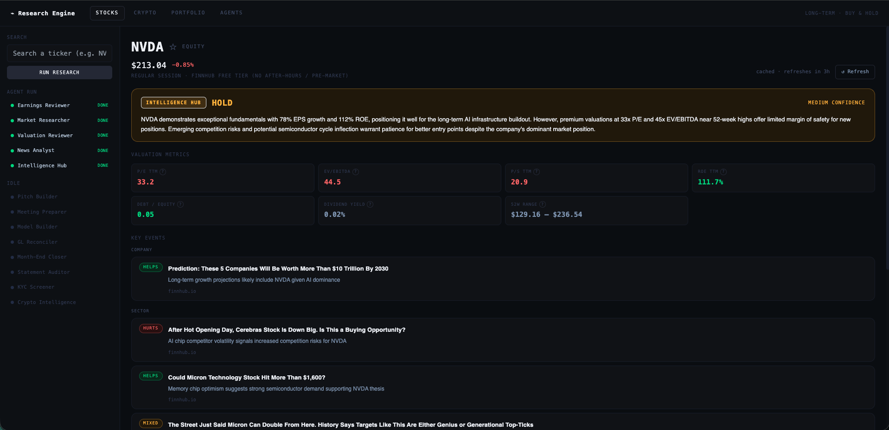
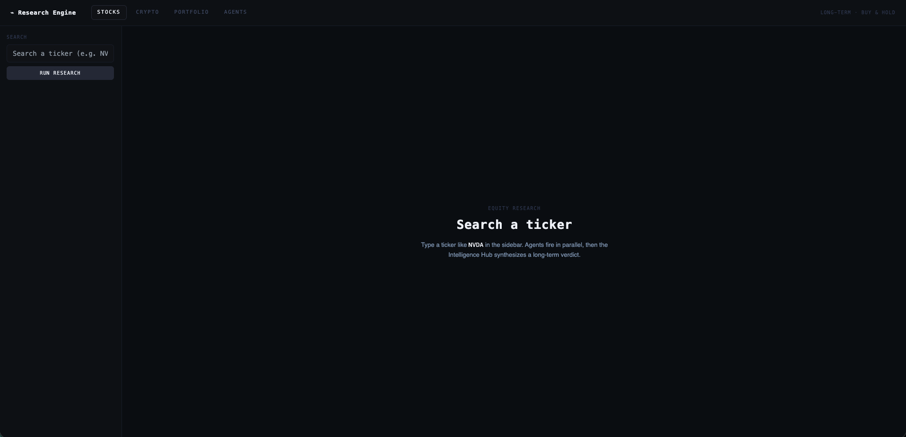
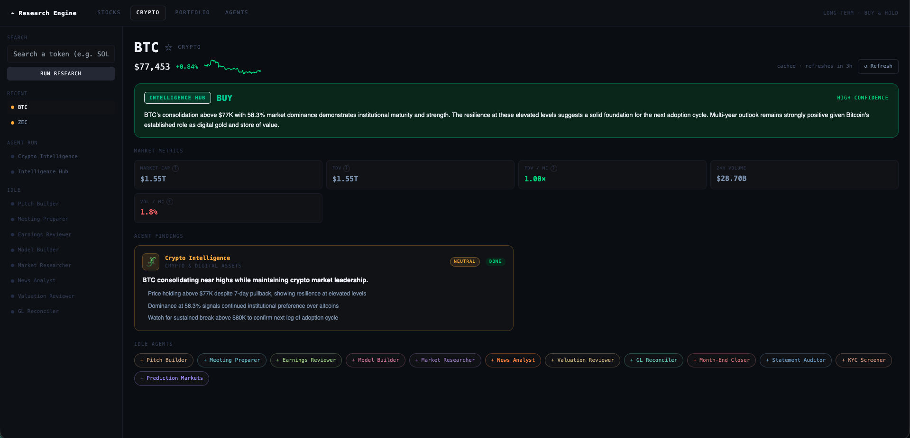
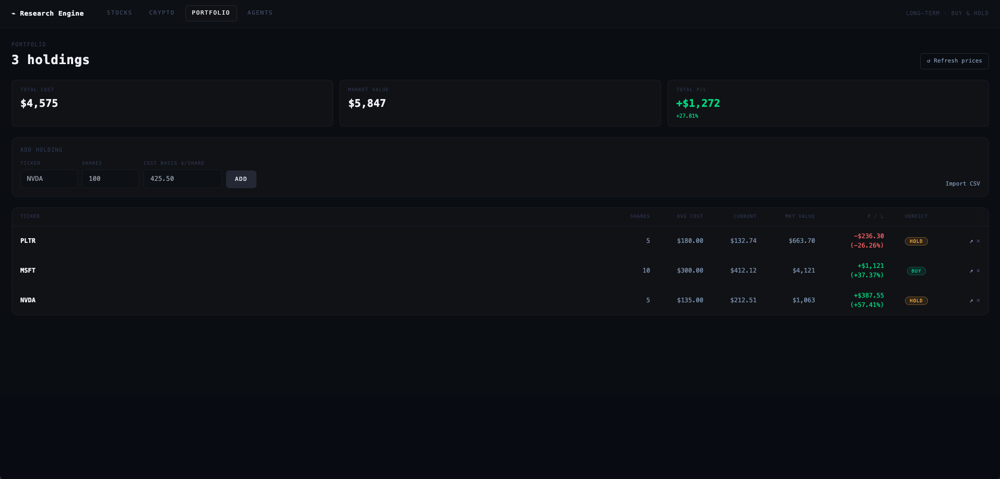
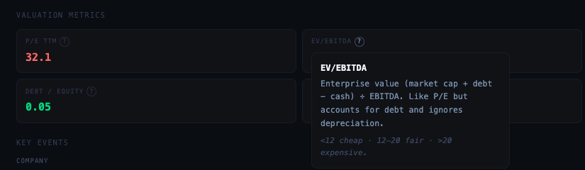
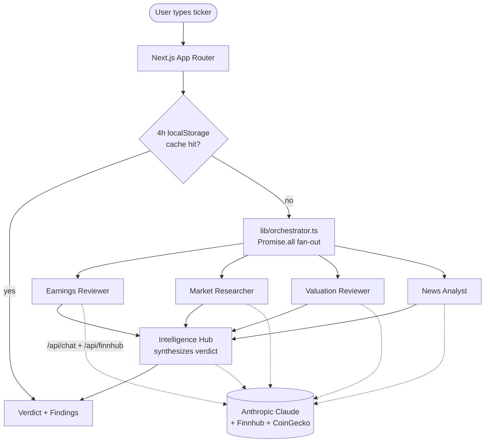

# Financial Research Engine

> Type a ticker. Four AI agents fan out in parallel. Get a long-term buy/hold verdict in under 10 seconds.

[Live demo](https://finances-dashboard-theta.vercel.app) · [Screenshots](#screenshots) · [Architecture](#architecture) · [Tech decisions](#tech-decisions-the-why)



---

## What it does

A search-driven research engine for a **long-term, buy-and-hold equity investor**. You type a stock ticker (`NVDA`) or crypto symbol (`BTC`) and four specialized agents fire in parallel against live Finnhub, CoinGecko, and Anthropic Claude. The **Intelligence Hub** then synthesizes their outputs into a single `STRONG BUY / BUY / HOLD / AVOID` verdict with a confidence band and a 3–4 sentence thesis.

Beyond the core search loop the app also ships:

- **Valuation panel** — P/E, EV/EBITDA, FCF margin, ROE, D/E, etc. with color-coded benchmark bands and `?` glossary tooltips
- **News Analyst** — recent company + sector headlines tagged Helps / Mixed / Hurts the long-term thesis
- **Watchlist** — star a ticker, 5-minute background poller flags verdict changes
- **Portfolio** — enter holdings (or paste a CSV) and get **cost-basis-aware** verdicts (the orchestrator bypasses cache for held tickers and feeds your average cost into the Hub prompt)

---

## Screenshots

| | |
|---|---|
|  <br/> *Empty search · sidebar + nav* |  <br/> *Crypto verdict with sparkline* |
|  <br/> *Portfolio · cost-basis-aware verdicts* |  <br/> *Glossary tooltip on P/E TTM* |

---

## Architecture



**Request flow** — browser hits Next.js Route Handlers (`/api/chat`, `/api/finnhub`, `/api/coingecko`, `/api/pmi`); secrets stay server-side. The orchestrator fans out four agent runners via `Promise.all`, waits for all four, then calls the Hub with a structured context block.

**Two-layer cache** — `next: { revalidate: 3600 }` on the raw API proxies (1h) plus a 4h `localStorage` cache on the synthesized verdict. Held tickers bypass the verdict cache so the Hub sees your live cost basis.

**Cross-tab sync** — `lib/watchlist.ts` and `lib/portfolio.ts` dispatch custom events (`watchlist:change` / `portfolio:change`) on every write so a star toggled in one tab updates the other. A 5-minute watchlist poller pauses on `document.visibilityState` to avoid burning quota in background tabs.

**Cost protection** — `lib/rateLimit.ts` applies an in-memory sliding-window limit (20 req / IP / hour) to `/api/chat` only. Defends the Anthropic key on a public URL until Phase B introduces per-account quotas tied to Google sign-in.

---

## Tech decisions (the why)

- **Promise.all fan-out beats sequential.** Four agent calls run in ~3s parallel vs ~12s sequential. The Hub waits for all of them, so total latency = max(agent) + Hub round-trip.
- **Two TTLs, not one.** Raw market data (`/quote`, `/company-news`) churns hourly; synthesized verdicts hold up for 4 hours. Mixing them into one TTL wastes Anthropic calls or serves stale prices — separating them gets you the cheap freshness *and* the cheap reuse.
- **Cost-basis-aware verdicts.** When `getHolding(ticker)` returns a position, the orchestrator skips the bare-ticker cache key and injects an explicit "user holds N shares at $X avg" block into the Hub prompt. A "BUY" recommendation reads very differently when you're already 40% up — the model needs to know.
- **Structured agent output.** Each runner appends `STRUCTURED_FORMAT` to its system prompt and the result flows through `parseAgentResponse` which tolerates Claude phrasing drift. UI cards render headline + signal pill + bullets when parsing succeeds, falling back to raw text when it doesn't.
- **Per-user persistence behind Google sign-in.** Watchlist + portfolio are server-backed in Neon Postgres (Drizzle ORM), gated by NextAuth + Google. Search and verdict stay fully public so anon recruiters can demo end-to-end. A one-time client-side migrator imports any pre-existing localStorage data on first sign-in, so power users don't lose their earlier state.
- **Session-aware rate limit on `/api/chat`.** Anon users get an IP-keyed sliding window (20/hour); signed-in users get a generous per-account daily quota (200/day). Same `lib/rateLimit.ts` helper, different key prefixes.

---

## Tech stack

**Next.js 14** (App Router) · **TypeScript** strict · **Tailwind CSS** · **Anthropic Claude** (Sonnet 4) · **Finnhub** · **CoinGecko** · **NextAuth v5** (Google) · **Neon Postgres** · **Drizzle ORM** · **Vercel**

No external state library. No tooltip / popover library. No Redux, no Zustand. Just `useState` / `useEffect`, server-fetched per-user state, and a couple of `CustomEvent`s for cross-tab sync.

---

## Local development

```bash
npm install
cp .env.local.example .env.local   # then fill in the three keys
npm run dev                        # http://localhost:3000
```

### Required env vars

| Key | Used by | How to get it |
|---|---|---|
| `ANTHROPIC_API_KEY` | All Claude calls (agent runners, Intelligence Hub) | console.anthropic.com |
| `NEXT_PUBLIC_FINNHUB_KEY` | Stock quotes, company news, earnings, fundamentals | finnhub.io/dashboard |
| `AUTH_SECRET` | NextAuth JWT signing | `openssl rand -base64 32` |
| `GOOGLE_CLIENT_ID` / `GOOGLE_CLIENT_SECRET` | Google OAuth for watchlist + portfolio sign-in | console.cloud.google.com → APIs & Services → Credentials → OAuth 2.0 Client ID (Web) |
| `DATABASE_URL` | Neon Postgres for per-user watchlist + portfolio | Vercel dashboard → Storage → Create Neon → connect to project; pull locally with `npx vercel env pull .env.local` |
| `PMI_JWT` | Heisenberg prediction markets (idle / manual only — optional) | narrative.agent.heisenberg.so → DevTools → Network → `Authorization` header. **Expires periodically.** |

`.env.local` is gitignored. Never put real keys in `.env.local.example`.

### Database migrations (Drizzle)

```bash
npx drizzle-kit generate    # produces SQL in db/migrations/
npx drizzle-kit push        # applies schema to DATABASE_URL
```

### Project layout

```
app/
├── layout.tsx
├── page.tsx                    # Renders <ResearchEngine />
└── api/
    ├── chat/route.ts           # Anthropic proxy + IP rate limit
    ├── finnhub/route.ts        # Finnhub proxy (revalidate: 3600, no-store on /quote)
    ├── coingecko/route.ts      # CoinGecko proxy (revalidate: 3600)
    └── pmi/route.ts            # Heisenberg PMI proxy (no cache)

lib/
├── orchestrator.ts             # runStockResearch / runCryptoResearch · Promise.all fan-out · 4h localStorage cache
├── agents.ts                   # AGENTS[] + AUTO_AGENT slug sets
├── rateLimit.ts                # In-memory sliding-window limiter
├── watchlist.ts                # localStorage CRUD + verdict-change detection
├── portfolio.ts                # localStorage CRUD + CSV parser + cost-basis lookup
├── metricsGlossary.ts          # 12 metric definitions + benchmark bands
├── verdictStyle.ts             # Rating palette + direction helper
└── types.ts

components/
├── ResearchEngine.tsx          # Root: nav + sidebar + result + watchlist poller
├── SearchSidebar.tsx
├── ResultPage.tsx              # Verdict + valuation + news + agent findings
├── VerdictCard.tsx
├── ValuationPanel.tsx          # P/E etc. tiles with color-coded bands
├── MetricTooltip.tsx           # `?` button + popover
├── NewsEventsPanel.tsx         # Helps / Mixed / Hurts tags grouped by scope
├── PortfolioView.tsx           # Manual entry + CSV paste + holdings table
├── PositionPanel.tsx           # Cost-basis P/L on result page when held
├── WatchlistSection.tsx
├── AgentFindingCard.tsx
├── AgentStatusList.tsx
└── ...
```

### Common tasks

| | |
|---|---|
| Add an agent that runs automatically | Add it to `AGENTS` in `lib/agents.ts`, add slug to `STOCK_AUTO_AGENTS`, add a runner in `lib/orchestrator.ts`, fold it into the `Promise.all` |
| Add a manual-only agent | Add to `AGENTS` only — it appears as a `+ Run` button on the result page |
| Refresh a stale verdict | Click `↺ Refresh` on the result page (clears the cache key for that ticker) |
| Rotate the PMI JWT | Paste a fresh value in `.env.local` and restart `npm run dev` |

---

## What's next

- **Tests + CI** — Vitest unit on `parseAgentResponse` / `parseNewsEventsResponse` / verdict regex / cache helpers, Playwright e2e on search → verdict, GitHub Actions for typecheck/lint/test/build on every push
- **Server-side cron** — Vercel Cron re-runs research on every signed-in user's watchlist daily; surfaces verdict changes via email digest
- **Streaming Claude responses** — SSE on `/api/chat` so finding cards materialize token-by-token
- **Sentry + structured logging**
- **Schwab OAuth** — replace manual portfolio entry with real brokerage sync

See [CLAUDE.md](CLAUDE.md) for the full design spec.
